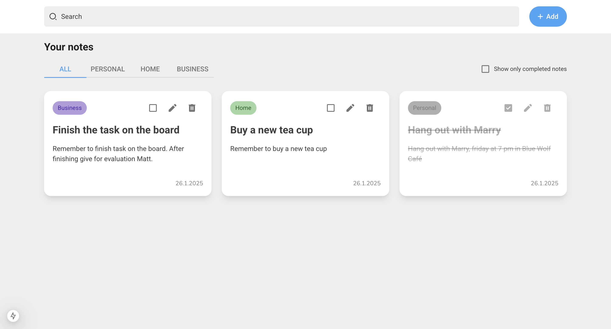

# Notely app

Application that allows users to manage their tasks with notes

## :pushpin: Table of contents

- [Introduction](#rocket-introduction)
- [Usage](#wrench-usage)
- [Built with](#hammer-built-with)
  - [Frontend](#computer-frontend)
  - [Deploy](#package-deployment)
- [Links](#link-links)
- [Author](#woman-author)

## :rocket: Introduction

## :wrench: Usage

To deploy the project locally, follow these steps:

1. Clone my repository with the command `git clone https://github.com/Inmacc96/notely.git`.
2. Next, run the following commands:

- `pnpm install`
- `pnpm dev`

Finally, you will have the page at http://localhost:3000/.

## :hammer: Built with

### :computer: Frontend

- [Next JS](https://nextjs.org/): React Framework used.
- [typescript](https://www.typescriptlang.org/): Programming language used.
- [tailwindcss](https://tailwindcss.com/): To style the application.
- [zod](https://zod.dev/): To validation data from server side
- [zustand](https://zustand.docs.pmnd.rs/): To manage app global state

### :package: Deployment

- [Vercel](https://www.vercel.com/)

## :link: Links

- Solution URL: [https://github.com/Inmacc96/notely.git](https://github.com/Inmacc96/notely.git)
- Live Site URL: [https://notely-omega.vercel.app/](https://notely-omega.vercel.app/)

## :woman: Author

- GitHub - [inmacc96](https://github.com/Inmacc96)
- LinkedIn - [Inma Caballero Carrero](https://www.linkedin.com/in/inmacaballerocarrero/)
